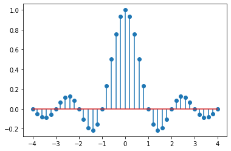

.. -*- coding: utf-8 -*-

.. _rcs_subversion:

Clase 04 - PIII 2021
====================
(Fecha: 20 de agosto)

Biblioteca matplotlib
=====================

- Generador de gráficos.
- `Documentación de matplotlib <https://matplotlib.org/>`_ 

**Algunos ejemplos de su uso**

.. code-block:: python

	import matplotlib.pyplot as plt
	import numpy as np

	n = 21
	x = np.linspace( 0, 2, n )  # del 0 al 2 (inclusive), en n=21 números equiespaciados
	x2 = x * x
	x3 = x ** 3
	plt.plot( x, x, 'b.', x, x2, 'rd', x, x3, 'g^' )

	plt.xlim( -1, 2.5 )  # límites para el eje x
	plt.gca().legend( ( 'Lineal', 'Cuadrática', 'Cúbica' ) )

	plt.show()

.. code-block:: python

	import matplotlib.pyplot as plt
	import numpy as np

	n = np.arange( 0, 5, 1 )
	y = np.exp( np.sin( n ) )

	plt.stem( n, y )
	plt.show()

.. code-block:: python

	import numpy as np
	import matplotlib.pyplot as plt

	# Variables independientes
	x1 = np.linspace( 1, 12, 12 )
	x2 = np.linspace( 1, 12, 12 ) + 2
	x3 = np.linspace( 1, 12, 12 )
	x4 = x2 + x3

	# Para varios gráficos es útil usar la función subplots y luego axs
	# Documentación de subplots en: https://matplotlib.org/stable/api/_as_gen/matplotlib.pyplot.subplots.html
	fig, axs = plt.subplots( nrows = 2, ncols = 2 )  
	fig.set_figwidth( 10 )
	fig.set_figheight( 6 )

	axs[ 0, 0 ].plot( x1, x2 )
	axs[ 0, 0 ].set_title( 'Gráfico 1' )
	axs[ 0, 0 ].set_xlabel( 'x' )
	axs[ 0, 0 ].set_ylabel( 'y' )

	axs[ 0, 1 ].plot( x1, x3 )
	axs[ 0, 1 ].set_title( 'Gráfico 2' )
	axs[ 0, 1 ].set_xlabel( 'x' )
	axs[ 0, 1 ].set_ylabel( 'y' )

	axs[ 1, 0 ].plot( x1, x4 )
	axs[ 1, 0 ].set_title( 'Gráfico 3' )
	axs[ 1, 0 ].set_xlabel( 'x' )
	axs[ 1, 0 ].set_ylabel( 'y' )

	axs[ 1, 1 ].scatter( x1, x4 )  # scatter plot = Diagrama de dispersión
	axs[ 1, 1 ].set_title( 'Gráfico 4' )
	axs[ 1, 1 ].set_xlabel( 'x' )
	axs[ 1, 1 ].set_ylabel( 'y' )

	plt.show()

.. code-block:: python

	import numpy as np
	import matplotlib.pyplot as plt

	x1 = np.linspace( 1, 12, 12 )
	x2 = np.linspace( 1, 12, 12 ) + 2

	fig, axs = plt.subplots( nrows = 2, ncols = 2 )  

	axs[ 0, 0 ].plot( x1, x2 )
	axs[ 0, 1 ].plot( x1, x2, 'g--d' )  
	axs[ 1, 0 ].scatter( x1, x2 )  
	axs[ 1, 1 ].stem( x1, x2 )
	plt.show()

Entregable Clase 04
===================

- Punto de partida: Usar Spyder para escribir el código desde cero
- Replicar exactamente la siguiente secuencia:

- Explicar a medida que se vaya haciendo el ejercicio.
- Entrar al siguiente `link para ver el registro de los entregables <https://docs.google.com/spreadsheets/d/1Qpp9mmUwuIUEbvrd_oqsQGuPOO9i1YPlHa_wBWTS6co/edit?usp=sharing>`_ 
- En caso de compartir video, se realiza en Youtube (No listado) compartiendo con el docente por mensaje privado de Teams.
- `Mesas de trabajo en Discord <https://discord.gg/TFKzMXrNCV>`_ 

**Alternativa para la creación de entornos virtuales**

- Módulo *venv*
- `Documentación de venv <https://docs.python.org/3/library/venv.html>`_ 
- Adaptar los siguientes comandos a lo visto en la `Clase 01 <https://github.com/cosimani/Curso-PIII-2021/blob/main/Clase01.rst>`_ 
- Este módulo ya viene instalado con Python (quizás debemos asegurarnos de esto durante la instalación)

.. code-block:: bash 

	cd C:\Cosas\2021\PIII2021\EntornosVirtuales  # Accedemos a la carpeta en donde creamos los entornos virtuales
	python -m venv entorno04                     # Creamos el entorno virtual
	.\entorno04\scripts\activate.bat             # Activamos el entorno virtual

	deactivate                                   # Desactivamos el entorno virtual

	# Para borrar el entorno virtual hay que borrar la carpeta donde se creó -> C:\Cosas\2021\PIII2021\EntornosVirtuales\entorno04
