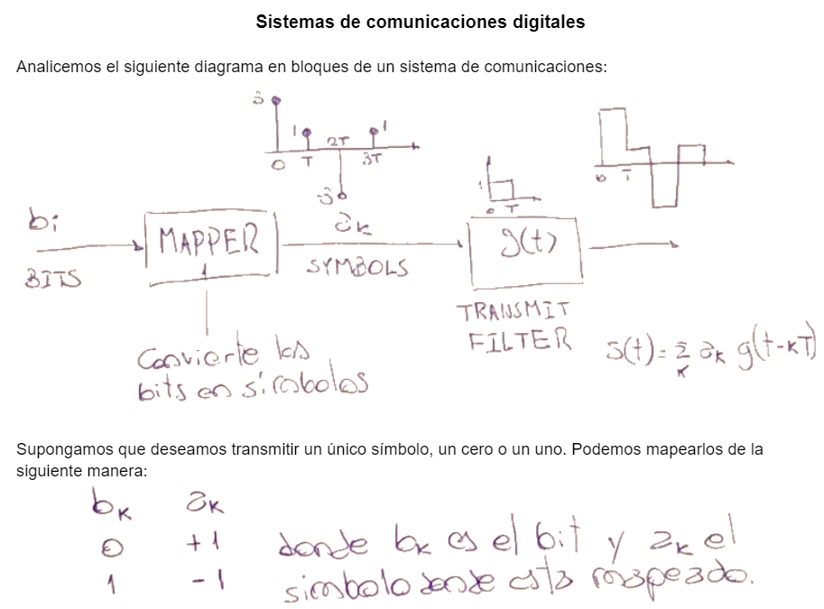
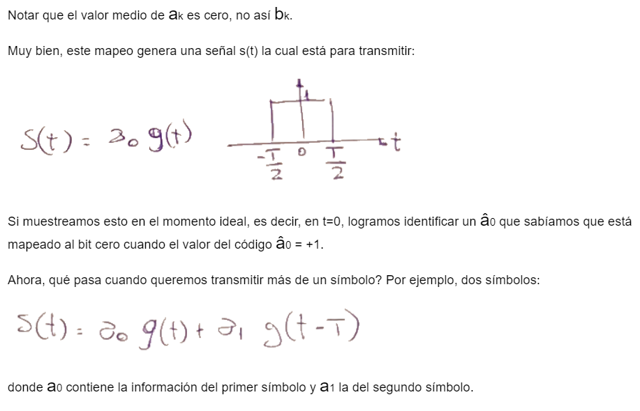
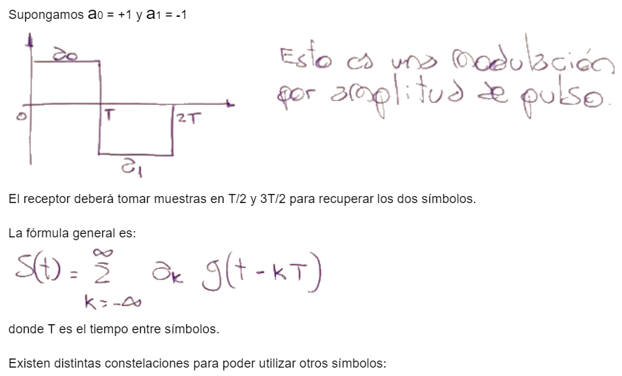

.. -*- coding: utf-8 -*-

.. _rcs_subversion:

Clase 10 - PIII 2021
====================
(Fecha: 15 de septiembre)

.. figure:: images/clase10_parte4.png

.. figure:: images/clase10_parte5.png

.. figure:: images/clase10_parte6.png

`Filtro transmisor (ipynb) <https://colab.research.google.com/drive/1TTM3s-seiJ2C7BfwcByFCVduOuGDdTeF?usp=sharing>`_ 
================================

Entregable Clase 10
===================

- Punto de partida: Copiar el cuaderno de la clase de hoy en otro llamado entregable10.ipynb
- Acercar el aspecto a la siguiente gráfica:

.. figure:: images/clase10_plot.png

- Se pide para este entregable grabar con OBS el video y subirlo a Youtube (Oculto).
- Entrar al siguiente `link para ver el registro de los entregables <https://docs.google.com/spreadsheets/d/1Qpp9mmUwuIUEbvrd_oqsQGuPOO9i1YPlHa_wBWTS6co/edit?usp=sharing>`_ 
- El link de Youtube se comparte con el docente por mensaje privado de Teams.
- En caso de requerir más tiempo para la entrega, escribir por WhatsApp al docente antes de medianoche.

