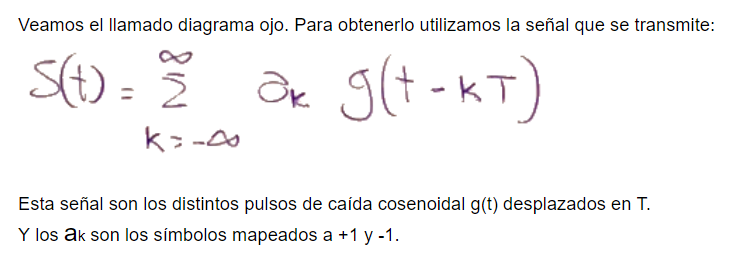
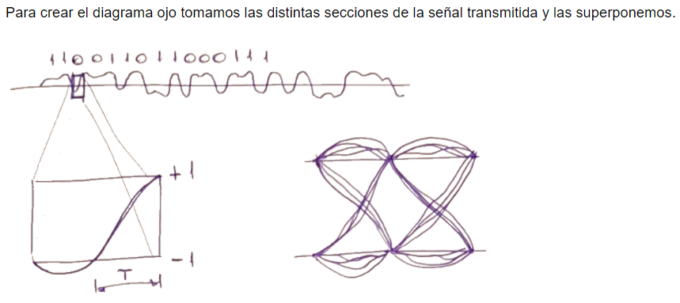
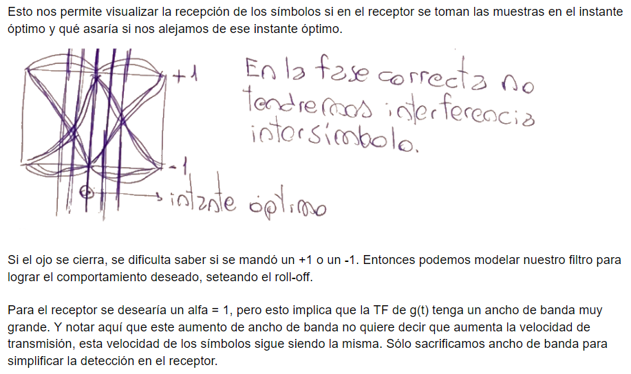
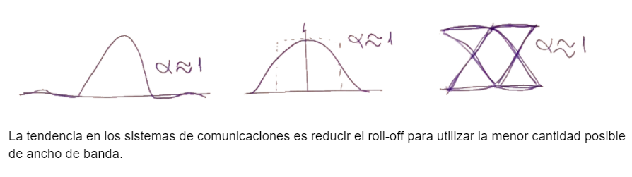

.. -*- coding: utf-8 -*-

.. _rcs_subversion:

Clase 13 - PIII 2021
====================
(Fecha: 23 de septiembre)

Diagrama ojo 
============

Entregable Clase 13
===================

- Punto de partida: Copiar el cuaderno de la clase de hoy en otro llamado entregable13.ipynb

- Para quienes están a distancia se pide para este entregable grabar con OBS el video y subirlo a Youtube (Oculto o No listado).
- Para quienes están presencial se puede presentar durante la clase o luego a través de un video con OBS en Youtube.
- Entrar al siguiente `link para ver el registro de los entregables <https://docs.google.com/spreadsheets/d/1Qpp9mmUwuIUEbvrd_oqsQGuPOO9i1YPlHa_wBWTS6co/edit?usp=sharing>`_ 
- El link de Youtube se comparte con el docente por mensaje privado de Teams.
- En caso de requerir más tiempo para la entrega, escribir por WhatsApp al docente antes de medianoche.

