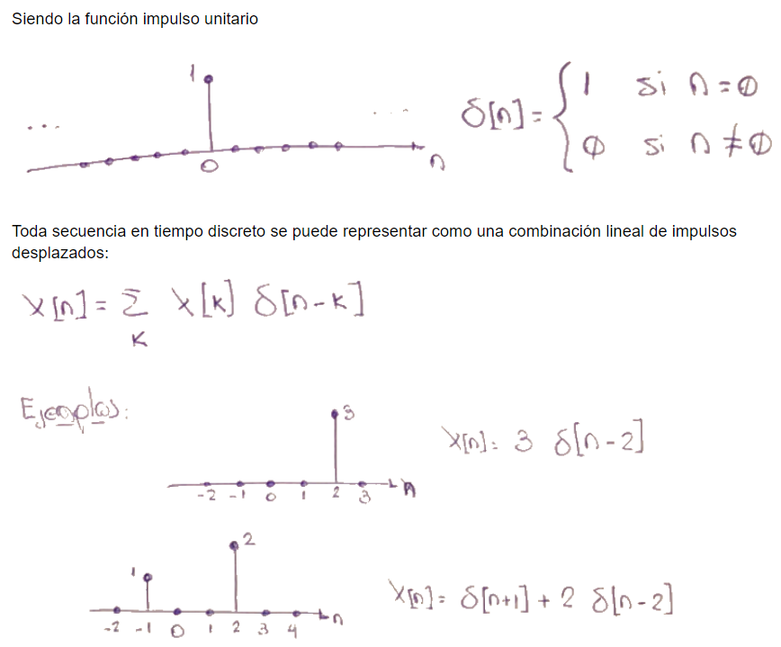
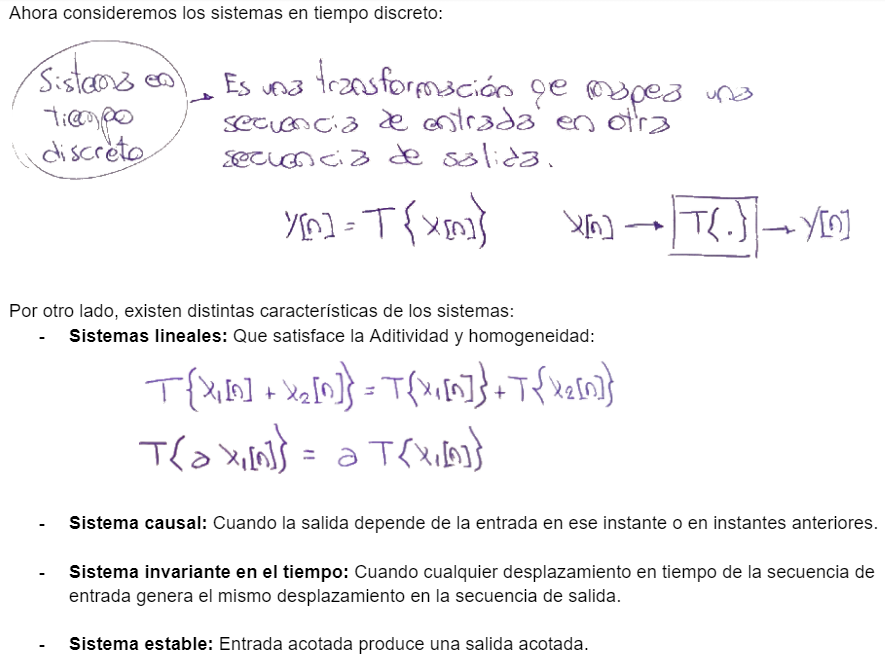
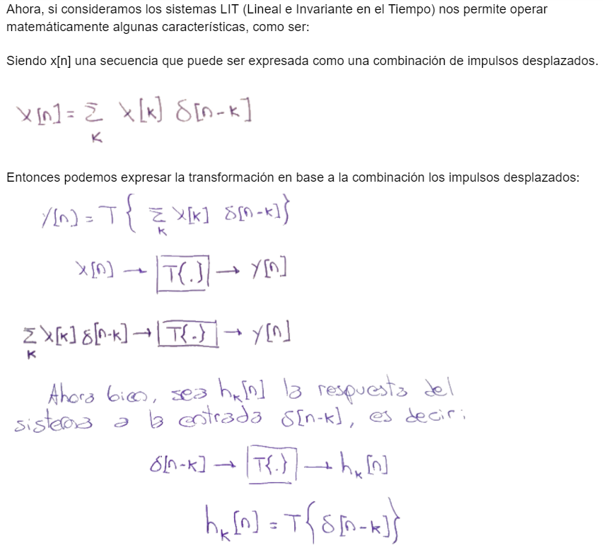
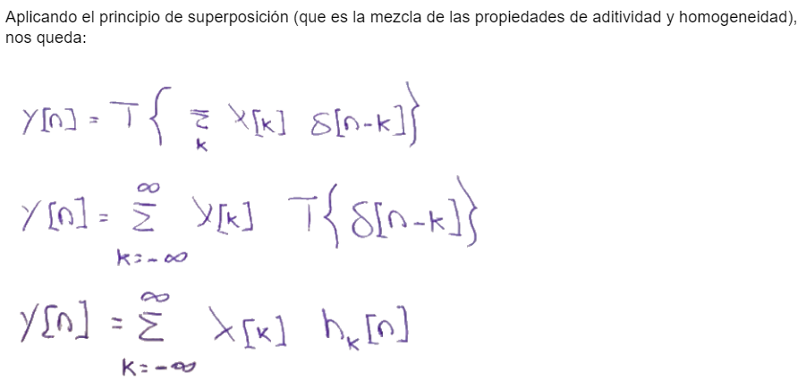
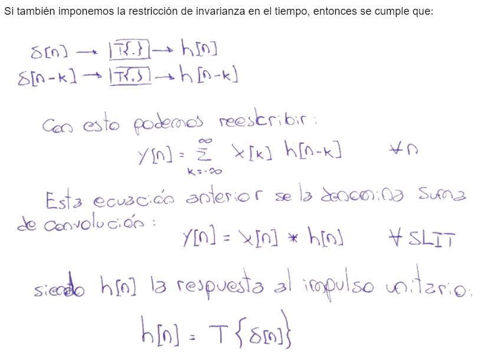
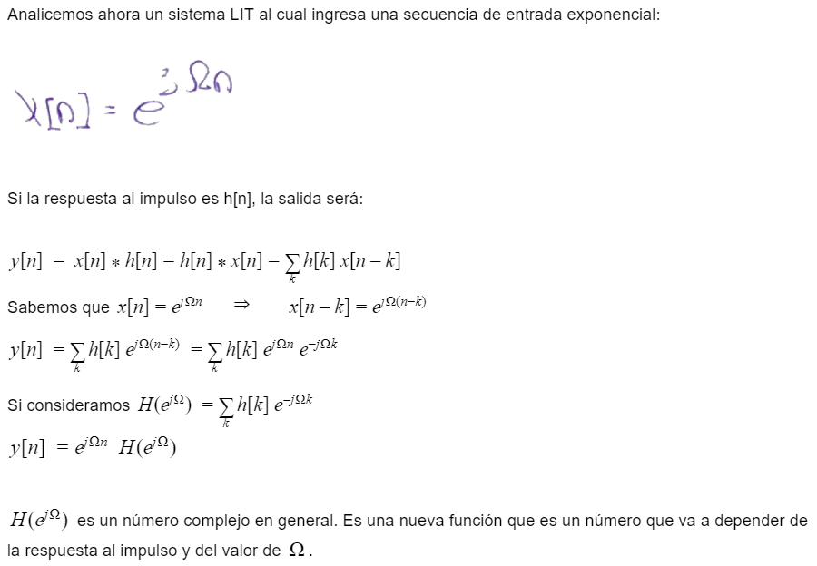
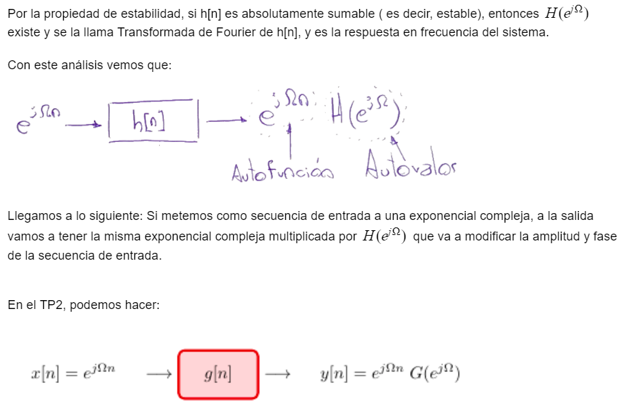
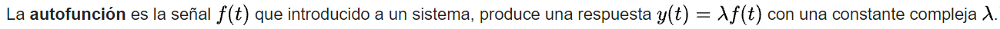
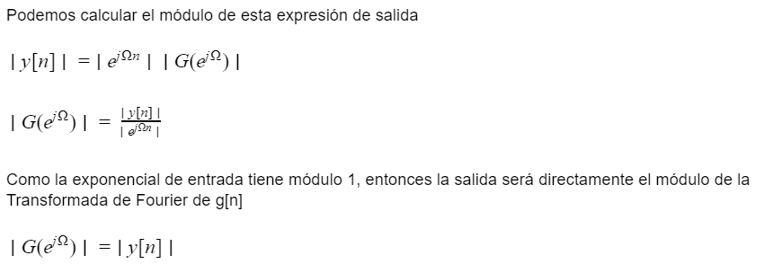
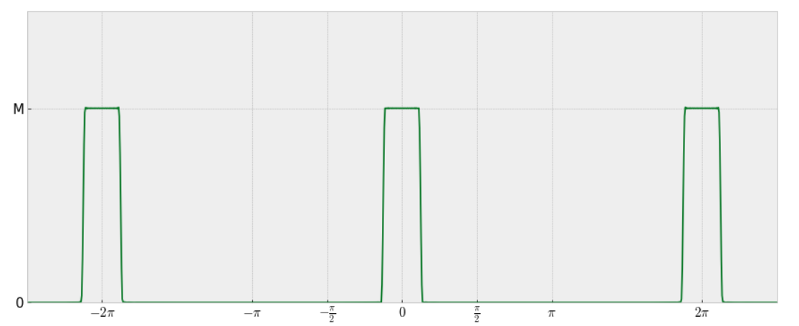

.. -*- coding: utf-8 -*-

.. _rcs_subversion:

Clase 14 - PIII 2021
====================
(Fecha: 4 de octubre)

Obtener la TF de g[n]
=====================

`Cálculo de la TF de g[n] (ipynb) <https://colab.research.google.com/drive/10sDyrNvIYlGaNo2VzqeJMYeJuP1THdYr?usp=sharing>`_ 
================================

Entregable Clase 14
===================

- Punto de partida: Cuaderno llamado entregable14.ipynb
- Elegir una secuencia f[n] y obtener a través de este método una visualización de su TF.
- Se entrega durante la clase 15 (día 4 de octubre)
- Para quienes están a distancia se pide para este entregable grabar con OBS el video y subirlo a Youtube (Oculto o No listado).
- Para quienes están presencial se puede presentar durante la clase o luego a través de un video con OBS en Youtube.
- Entrar al siguiente `link para ver el registro de los entregables <https://docs.google.com/spreadsheets/d/1Qpp9mmUwuIUEbvrd_oqsQGuPOO9i1YPlHa_wBWTS6co/edit?usp=sharing>`_ 
- El link de Youtube se comparte con el docente por mensaje privado de Teams.
- En caso de requerir más tiempo para la entrega, escribir por WhatsApp al docente antes de medianoche.

