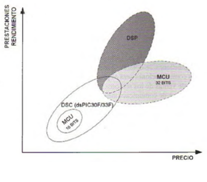

.. -*- coding: utf-8 -*-

.. _rcs_subversion:

Clase 15 - PIII 2021
====================
(Fecha: 6 de octubre)

Revisión rápida microcontroladores, placas de desarrollo, programación sobre DSPs
=================================================================================

Familias de microcontroladores Microchip
----------------------------------------

*MCU (MicroController Unit)*
	- Microcontroladores clásicos
	- Las operaciones complejas las realiza en varios ciclos
	
*DSP (Digital Signal Processor)*
	- Microcontroladores para procesamiento de señales
	- Las operaciones complejas las realiza en un sólo ciclo.

*DSC (Digital Signal Controller)*
	- Híbrido MCU/DSP
	- Controlador digital de señales
	

*dsPIC (Nombre que utiliza Microchip para referirse a sus DSC)*
	- Registros de 16 bits
	- Familias dsPIC30F y dsPIC33F
	- Es accesible conseguir los siguientes: 
	#. dsPIC30F4013 (40 pines)
 	#. dsPIC30F2010 (28 pines)
	#. dsPIC33FJ32MC202 (28 pines)

Softwares
---------
- Proteus
- mikroC para dsPIC
- MATLAB

*Proteus*
	- Conjunto de programas para diseño y simulación
	- Desarrollado por Labcenter Electronics (http://www.labcenter.com)
	- Versión actual: 8.7
	- Versión 8.1 para compartir. Algunos problemas con Windows 10
	- Versión 7.9 para compartir. Estable para Windows 10
	- Herramientas principales: ISIS y ARES

*ISIS (Intelligent Schematic Input System - Sistema de Enrutado de Esquemas Inteligente)*
	- Permite diseñar el circuito con los componentes.
	- Permite el uso de microcontroladores grabados con nuestro propio programa.
	- Contiene herramientas de medición, fuentes de alimentación y generadores de señales.
	- Puede simular en tiempo real mediante VSM (Virtual System Modeling -Sistema Virtual de Modelado).

*ARES (Advanced Routing and Editing Software - Software de Edición y Ruteo Avanzado)*
	- Permite ubicar los componentes y rutea automáticamente para obtener el PCB (Printed Circuit Board).
	- Permite ver una visualización 3D de la placa con sus componentes.

*mikroC para dsPIC*
	- Compilador C para dsPIC
	- Incluye bibliotecas de programación
	- Última versión 7.1.0 (mayo de 2018)
	- Desarrollado por MikroElektronika ( https://www.mikroe.com/mikroc/#dspic )
	- MikroElektronika también dispone de placas de desarrollo como la Easy dsPIC que disponemos en el Lab
	
*MATLAB*
	- IDE con un lenguaje de programación propio.
	- Simulación, matrices, algoritmos, GUI, DSP, ...
	- Última versión R2020a (marzo de 2020).

Entregable Clase 15
===================

- Punto de partida: 
- Para quienes están a distancia se pide para este entregable grabar con OBS el video y subirlo a Youtube (Oculto o No listado).
- Para quienes están presencial se puede presentar durante la clase o luego a través de un video con OBS en Youtube.
- Entrar al siguiente `link para ver el registro de los entregables <https://docs.google.com/spreadsheets/d/1Qpp9mmUwuIUEbvrd_oqsQGuPOO9i1YPlHa_wBWTS6co/edit?usp=sharing>`_ 
- El link de Youtube se comparte con el docente por mensaje privado de Teams.

