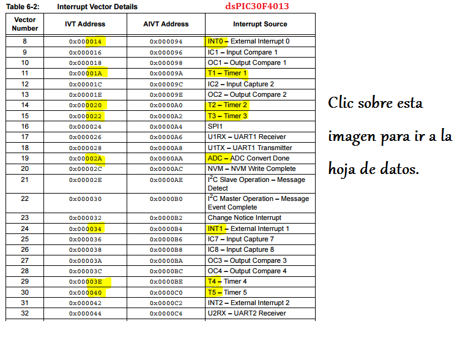
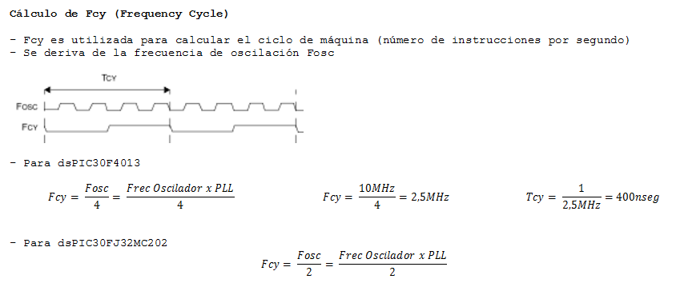

.. -*- coding: utf-8 -*-

.. _rcs_subversion:

Clase 15 - PIII 2021
====================
(Fecha: 6 de octubre)

Revisión rápida microcontroladores, placas de desarrollo, programación sobre DSPs
=================================================================================

Familias de microcontroladores Microchip
----------------------------------------

*MCU (MicroController Unit)*
	- Microcontroladores clásicos
	- Las operaciones complejas las realiza en varios ciclos
	
*DSP (Digital Signal Processor)*
	- Microcontroladores para procesamiento de señales
	- Las operaciones complejas las realiza en un sólo ciclo.

*DSC (Digital Signal Controller)*
	- Híbrido MCU/DSP
	- Controlador digital de señales
	
.. figure:: images/clase15_precio_rendimiento.png

*dsPIC (Nombre que utiliza Microchip para referirse a sus DSC)*
	- Registros de 16 bits
	- Familias dsPIC30F y dsPIC33F
	- Es accesible conseguir los siguientes: 
	#. dsPIC30F4013 (40 pines)
 	#. dsPIC30F2010 (28 pines)
	#. dsPIC33FJ32MC202 (28 pines)

Softwares
---------
- Proteus
- mikroC para dsPIC
- MATLAB

*Proteus*
	- Conjunto de programas para diseño y simulación
	- Desarrollado por Labcenter Electronics (http://www.labcenter.com)
	- Versión actual: 8.7
	- Versión 8.1 para compartir. Algunos problemas con Windows 10
	- Versión 7.9 para compartir. Estable para Windows 10
	- Herramientas principales: ISIS y ARES

*ISIS (Intelligent Schematic Input System - Sistema de Enrutado de Esquemas Inteligente)*
	- Permite diseñar el circuito con los componentes.
	- Permite el uso de microcontroladores grabados con nuestro propio programa.
	- Contiene herramientas de medición, fuentes de alimentación y generadores de señales.
	- Puede simular en tiempo real mediante VSM (Virtual System Modeling -Sistema Virtual de Modelado).

*ARES (Advanced Routing and Editing Software - Software de Edición y Ruteo Avanzado)*
	- Permite ubicar los componentes y rutea automáticamente para obtener el PCB (Printed Circuit Board).
	- Permite ver una visualización 3D de la placa con sus componentes.

*mikroC para dsPIC*
	- Compilador C para dsPIC
	- Incluye bibliotecas de programación
	- Última versión 7.1.0 (mayo de 2018)
	- Desarrollado por MikroElektronika ( https://www.mikroe.com/mikroc/#dspic )
	- MikroElektronika también dispone de placas de desarrollo como la Easy dsPIC que disponemos en el Lab
	
*MATLAB*
	- IDE con un lenguaje de programación propio.
	- Simulación, matrices, algoritmos, GUI, DSP, ...
	- Última versión R2020a (marzo de 2020).

Interrupciones
--------------

- Eventos que hacen que el dsPIC deje de realizar lo que está haciendo y pase a ejecutar otra tarea.
- Las causas pueden ser diferentes (Interrupciones externas, Timers, ADC, UART, etc.).
- 7 niveles de prioridad (1 a 7 a través de los registros IPCx). Con 0 se desactiva la interrupción.
- Permite que una interrupción de mayor prioridad invalide una de menor prioridad que esté en progreso.
- Existe una tabla de vectores de interrupción (IVT) que indica dónde escribir la función que atenderá dicha interrución.
- También hay una tabla alternativa (AIVT) que se usa en situaciones de depuración o pruebas sin necesidad de reprogramar las interrupciones. También puede que un programa esté dividido en aplicaciones: una aplicación en el bootloader y otra aplicación principal. Entonces, una de ellas usa el AIVT y la otra el IVT.
- Cuando una interrupción es atendida, el PC (Program Counter) se carga con la dirección que indica la tabla de vector de interrupción (IVT)

   
.. figure:: images/clase15_ivt_dspic33F.png
   :target: http://ww1.microchip.com/downloads/en/DeviceDoc/70214C.pdf

Registros para configuración
----------------------------
	
- IFS0<15:0>, IFS1<15:0>, IFS2<15:0>
	- Banderas de solicitud de interrupción. (el software debe borrarlo - hay que hacerlo sino sigue levantando la interrupción).

- IEC0<15:0>, IEC1<15:0>, IEC2<15:0>
	- Bits de control de habilitación de interrupción.

- IPC0<15:0>... IPC10<7:0>
	- Prioridades

- INTCON1<15:0>, INTCON2<15:0>
	- Control de interrupciones.
		- INTCON1 contiene el control y los indicadores de estado. 
		- INTCON2 controla la señal de petición de interrupción externa y el uso de la tabla AIVT.

.. figure:: images/clase15_registro_interrupciones.png
   :target: http://ww1.microchip.com/downloads/en/devicedoc/70138c.pdf

.. figure:: images/clase15_manejo_osciladores.png

.. figure:: images/clase15_osciladores.png
   :target: http://ww1.microchip.com/downloads/en/DeviceDoc/70046E.pdf

**Pinout de algunos dsPIC**

.. figure:: images/clase15_dspic33fj32mc202.png
   :target: http://ww1.microchip.com/downloads/en/DeviceDoc/70283K.pdf

.. figure:: images/clase15_dspic30f4013.png
   :target: http://ww1.microchip.com/downloads/en/devicedoc/70138c.pdf

.. figure:: images/clase15_manejo_timers.png

.. figure:: images/clase15_map_timer23.png
   :target: http://ww1.microchip.com/downloads/en/devicedoc/70138c.pdf

.. figure:: images/clase15_ejemplo.png

.. code-block::

	void detectarIntT1() org 0x001a  {
	    LATBbits.LATB0 = !LATBbits.LATB0;
	    IFS0bits.T1IF = 0;  // Borramos la bandera de interrupción T1
	}

	void main()  {
	    TRISBbits.TRISB0 = 0;
	    LATBbits.LATB0 = 0;

	    // Modo de operación Timer1
	    T1CON = 0x0000;

	    // Modo operación Timer1: reloj interno, escala 1:1, empieza cuenta en 0
	    TMR1 = 0;

	    // Cuenta 500 ciclos
	    PR1 = 500;

	    // Interrupciones Timer1, borra Bandera de interrupción
	    IFS0bits.T1IF = 0;

	    // Habilita interrupción
	    IEC0bits.T1IE = 1;

	    // Arranca Timer1
	    T1CONbits.TON = 1;

	    while( 1 )
	       asm nop;
	}

Entregable Clase 15
===================

- Punto de partida: 
- Para quienes están a distancia se pide para este entregable grabar con OBS el video y subirlo a Youtube (Oculto o No listado).
- Para quienes están presencial se puede presentar durante la clase o luego a través de un video con OBS en Youtube.
- Entrar al siguiente `link para ver el registro de los entregables <https://docs.google.com/spreadsheets/d/1Qpp9mmUwuIUEbvrd_oqsQGuPOO9i1YPlHa_wBWTS6co/edit?usp=sharing>`_ 
- El link de Youtube se comparte con el docente por mensaje privado de Teams.

