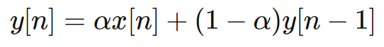
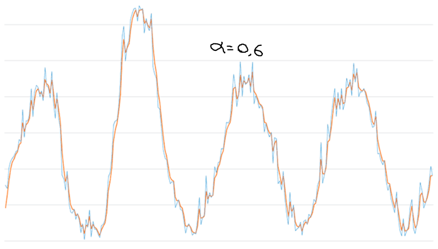
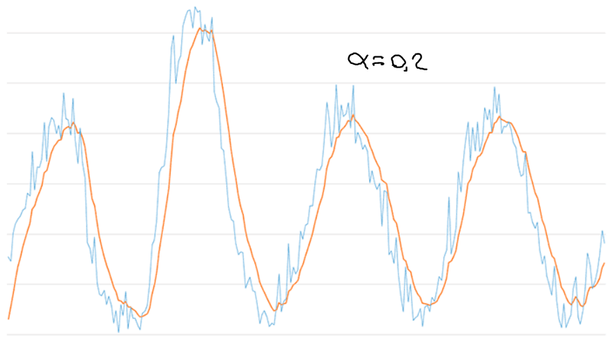

.. -*- coding: utf-8 -*-

.. _rcs_subversion:

Clase 16 - PIII 2021
====================
(Fecha: 13 de octubre)

Exponential Moving Average Filter
=================================

- La ecuación en diferencia para este filtro es la siguiente:

- alpha está en el intervalo ``[0, 1]`` y es el factor de suavizado
- ``y[n]`` es la salida actual
- ``y[n - 1]`` es la salida anterior
- ``x[n]`` es la entrada actual

Ejemplos con distintos valores de factor de suavizado
-----------------------------------------------------

- Se llama exponencial porque el factor de ponderación aplicado a las entradas pasadas disminuye exponencialmente. Lo podemos visualizar sustituyendo las salidas anteriores.

.. figure:: images/clase16_sumatoria_ema.png

Entregable Clase 16
===================

- Punto de partida: Cuaderno en Google Colab entregable16.ipynb
- Capturar con el micrófono algunos segundos.
- Definir una función en Python que aplique este filtro de media móvil exponencial.
- Suavizar la señal con un factor de 0.6, 0.2 y 0.05 y visualizar el resultado.
- Realizar un análisis del espectro de frecuencias. Comente algunas conclusiones.
- Para quienes están a distancia se pide para este entregable grabar con OBS el video y subirlo a Youtube (Oculto o No listado).
- Para quienes están presencial se puede presentar durante la clase o luego a través de un video con OBS en Youtube.
- Entrar al siguiente `link para ver el registro de los entregables <https://docs.google.com/spreadsheets/d/1Qpp9mmUwuIUEbvrd_oqsQGuPOO9i1YPlHa_wBWTS6co/edit?usp=sharing>`_ 
- El link de Youtube se comparte con el docente por mensaje privado de Teams.

