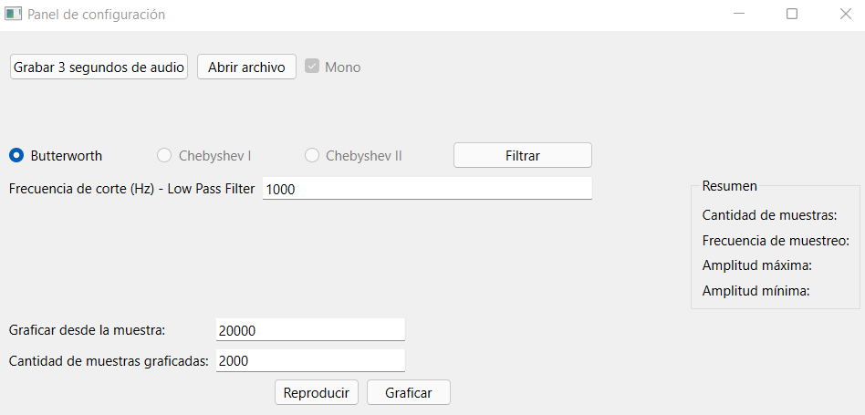

.. -*- coding: utf-8 -*-

.. _rcs_subversion:

Clase 20 - PIII 2021
====================
(Fecha: 1 de noviembre)

Aplicar filtros digitales
=========================

- `Lectura de archivos de audio <https://docs.scipy.org/doc/scipy/reference/generated/scipy.io.wavfile.read.html>`_  

- `Filtro de Butterworth <https://docs.scipy.org/doc/scipy/reference/generated/scipy.signal.butter.html>`_  

- `Aquí el archivo .ui <https://github.com/cosimani/Curso-PIII-2021/blob/main/images/panel_clase20.ui>`_  

ventana.py
----------

.. code-block:: python

	import os, sys

	from PySide6.QtCore import *
	from PySide6.QtWidgets import QWidget, QApplication, QGridLayout, QFileDialog
	from PySide6.QtUiTools import QUiLoader

	import numpy as np

	from matplotlib import pyplot as plt
	plt.style.use( 'seaborn-darkgrid' )

	from scipy import signal
	from scipy.io import wavfile
	import sounddevice as sd

	class Ventana( QWidget ) :
	    
	    def __init__( self ) :
	        super( Ventana, self ).__init__()

	        loader = QUiLoader()
	        self.gui = loader.load( "panel_clase20.ui", None )  # panel.ui debe estar en la misma carpeta

	        # Define un layout en Ventana y coloca allí la interfaz creada con QtDesigner
	        grid = QGridLayout()
	        grid.setContentsMargins( 0, 0, 0, 0 )
	        grid.addWidget( self.gui )
	        self.setLayout( grid )
	 
	        self.setWindowTitle( 'Panel de configuración' )

	        QObject.connect( self.gui.pbReproducir, SIGNAL( "pressed()" ), self.slot_reproducir )
	        QObject.connect( self.gui.pbGrabar, SIGNAL( "pressed()" ), self.slot_grabarAudio )
	        QObject.connect( self.gui.pbFiltrar, SIGNAL( "pressed()" ), self.slot_filtrar )
	        QObject.connect( self.gui.pbAbrir, SIGNAL( "pressed()" ), self.slot_abrir )        

	    def slot_reproducir( self ) :
	        
	        sd.play( self.xn_filtrada, self.samplerate )

	    def slot_abrir( self ) :     
	    
	        self.fileName = QFileDialog.getOpenFileName( self, "Abrir archivo WAV", "./", "Audio (*.wav)" )   
	        print( self.fileName )
	        

	    def slot_grabarAudio( self ) :
	  
	        duracion = 3
	        frecuencia_muestreo = 44100
	          
	        self.grabacion = sd.rec( int( duracion * frecuencia_muestreo ), 
	                                 samplerate = frecuencia_muestreo, 
	                                 channels = 1, 
	                                 blocking = True ) 

	        print( type( self.grabacion ) )
	        print( self.grabacion, self.grabacion.shape )

	        self.gui.pbGrabar.setEnabled( False )
	        self.gui.pbAbrir.setEnabled( False )
	        self.gui.pbGraficar.setEnabled( False )

	    def slot_filtrar( self ) :

	        self.samplerate, data = wavfile.read( self.fileName[ 0 ] )
	        print(f"Número de canales = {data.shape[1]}")
	        length = data.shape[0] / self.samplerate
	        print(f"Duración = {length} seg")

	        # Tomamos sólo el canal izquierdo
	        self.xn = data[:, 0]
	        desde = int( self.gui.leDesdeLaMuestra.text() )
	        hasta = desde + int( self.gui.leCantMuestrasGraficadas.text() )

	        time = np.linspace( 0., length, data.shape[ 0 ] )

	        fig, (ax1, ax2) = plt.subplots(2, 1, sharex=True)
	        ax1.plot(time[desde : hasta], self.xn[desde : hasta])

	        b, a = signal.butter( 10, int( self.gui.leLowPassCorte.text() ), btype='lowpass', fs = self.samplerate )

	        self.xn_filtrada = signal.filtfilt( b, a, self.xn )

	        ax2.plot( time[desde : hasta], self.xn_filtrada[desde : hasta] )
	        ax2.set_xlabel( 'Segundos' )
	        plt.show()
	       

	    def keyPressEvent( self, e ) :

	        if e.key() == Qt.Key_Escape :
	            self.close()

	# Función main que se ejecuta al iniciar la aplicación
	if __name__ == '__main__':

	    # Este objeto representa a la aplicación
	    app = QApplication( sys.argv )

	    os.chdir( os.path.dirname( os.path.abspath( __file__ ) ) )

	    # Creamos y visualizamos el objeto Ventana que contiene la interfaz creada en QtDesigner
	    ventana = Ventana()
	    ventana.show()

	    sys.exit( app.exec_() )

Entregable Clase 20
===================

- Punto de partida: Ejemplo de clase.
- Acondicionar para aplicar el filtro a una grabación con el micrófono.
- Completar los datos del audio en los labels del QGroupBox.

- Para quienes están a distancia se pide para este entregable grabar con OBS el video y subirlo a Youtube (Oculto o No listado).
- Para quienes están presencial se puede presentar durante la clase o luego a través de un video con OBS en Youtube.
- Entrar al siguiente `link para ver el registro de los entregables <https://docs.google.com/spreadsheets/d/1Qpp9mmUwuIUEbvrd_oqsQGuPOO9i1YPlHa_wBWTS6co/edit?usp=sharing>`_ 
- El link de Youtube se comparte con el docente por mensaje privado de Teams.

